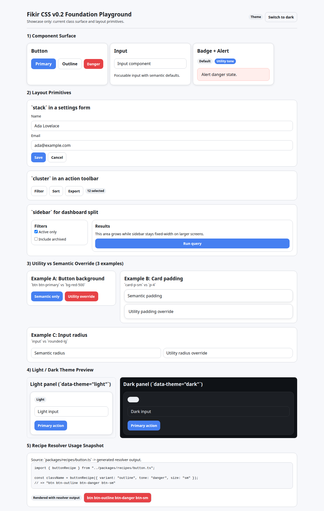

# Fikir CSS

Contract-driven CSS foundation prototype (v0.2).

Fikir CSS is an experimental foundation repository focused on predictable cascade behavior, contract-based selector generation, and low-runtime CSS delivery. It is not a complete framework yet.

## Current Status
- Stage: `v0.2 foundation stabilization`
- Scope: tokens, reset/base, layout primitives, utilities, a small semantic surface, contract-driven recipes
- Stability: prototype; APIs and file layout may still change between minor tags
- Intended use: architecture exploration and tooling validation

## Non-goals (Current)
- Full component library
- Full static extraction/compiler engine
- Production-ready plugin ecosystem
- Marketing/demo site as a product surface

## Quick Start
1. Install dependencies
   - `npm install`
2. Build CSS and generated artifacts
   - `npm run build`
3. Open playground
   - `playground/index.html`

If `dist/fikir.css` is missing, run `npm run build` first.

## Playground / Demo
- Path: `playground/`
- Purpose: showcase current foundation only (not production app patterns)
- Covers:
  - button, card, input, badge, alert
  - `stack`, `cluster`, `sidebar`
  - utility vs semantic override examples
  - light/dark token behavior
  - recipe resolver output snapshot

See [playground/README.md](./playground/README.md) for section details.

### Playground Screenshot

## Architecture (v0.2)
Single sources of truth:
- Naming contract: `contracts/naming.contract.mjs`
- Recipe contract: `contracts/recipes.contract.mjs`

Build/validation entrypoint:
- `scripts/build-css.mjs`

Generated outputs:
- `dist/fikir.css`
- `packages/recipes/index.css`
- `packages/recipes/generated/resolvers.ts`
- `dist/contracts/selectors.json`
- `dist/contracts/alias-migration.json`
- `dist/contracts/size-report.json`

## Documentation Map
- Technical summary: `docs/architecture/technical-summary.md`
- Validation pipeline: `docs/architecture/validation-pipeline.md`
- Naming contract: `docs/contracts/naming-contract.md`
- Recipe contract: `docs/contracts/recipe-contract.md`
- Minimal test plan: `docs/testing/minimal-test-plan.md`
- Critical automation areas: `docs/testing/critical-automation-areas.md`
- Migration notes: `docs/migration/`
- Release notes: `docs/release/`

## Roadmap (Near-term)
- v0.2.x:
  - improve automated validation coverage
  - keep contract consistency and migration docs up to date
- v0.3 (planned, not committed):
  - stronger CI gates for contract parity and alias migration safety

## Experimental Areas
- Contract schema evolution (`contracts/*.mjs`)
- Build-time generation and validation boundaries (`scripts/build-css.mjs`)
- Selector migration workflow (`dist/contracts/alias-migration.json`)

## Contributing
Please read [CONTRIBUTING.md](./CONTRIBUTING.md) before opening issues or pull requests.

## License
MIT. See [LICENSE](./LICENSE).
