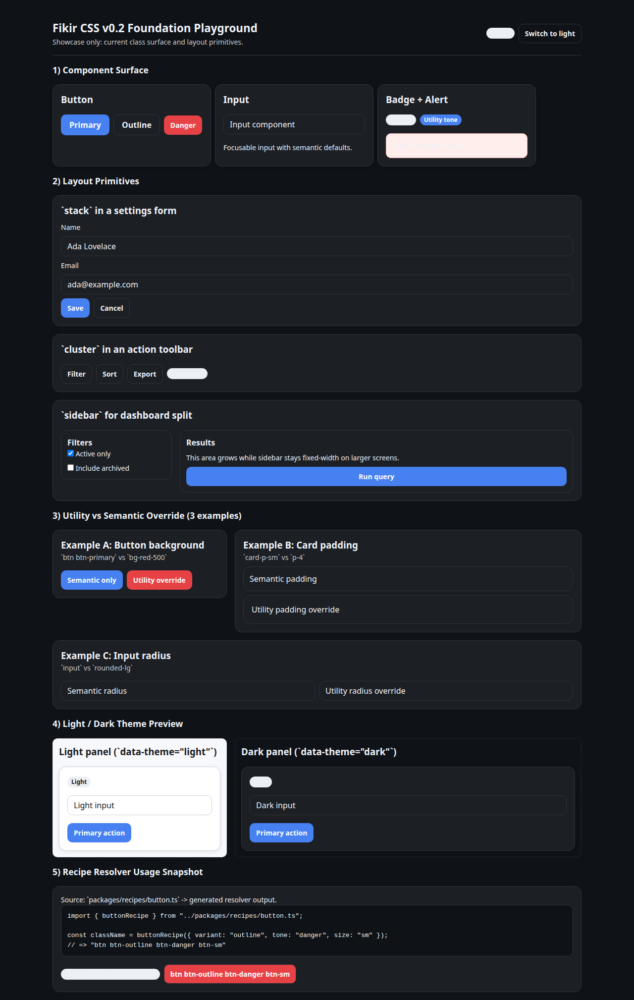

# Playground (v0.2 Foundation Showcase)

## Recommended folder structure

```text
playground/
├─ index.html
├─ demo.css
├─ demo.js
└─ README.md
```

## Sections in this demo
1. Component surface (button, card, input, badge, alert)
2. Layout primitives (`stack`, `cluster`, `sidebar`)
3. Utility vs semantic override (3 examples)
4. Light/dark preview (`data-theme`)
5. Recipe resolver usage snapshot

## Screenshots
Light mode (placeholder):


Dark mode (placeholder):



Before publishing, replace these placeholders with real captures from `playground/index.html`.

## How it binds to current foundation
- Framework styles: `../dist/fikir.css`
- Demo-only styling: `./demo.css`
- Demo interactions: `./demo.js`

## Run
1. Build CSS bundle:
   - `npm run build`
2. Open demo:
   - `playground/index.html`

If bundle is missing, the page shows:
- `Build output missing: dist/fikir.css is not loaded. Run npm run build.`

## Dark Mode Note
- Demo-specific text and panel colors are token-based and keep readable contrast in dark mode.

This is a showcase/playground, not a production app.
